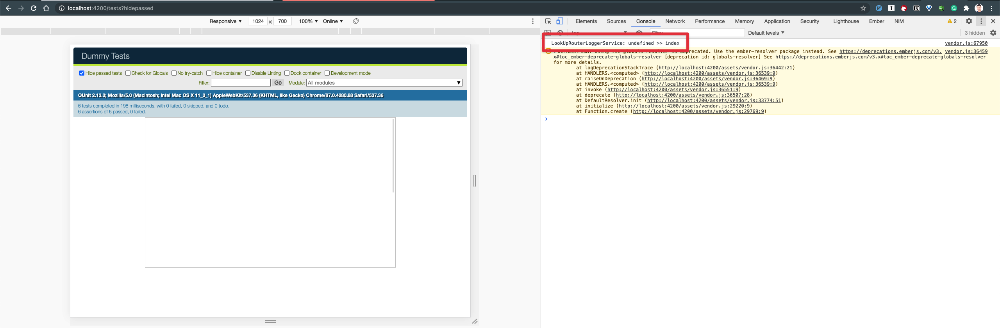

# router-injection-addon

To facilitate discussions in https://github.com/emberjs/rfcs/pull/680

See 

The service being looked up in the *instance-initializer* cannot be re-registered in test, the only way to override the base class behavior is to mutate the concrete service instance.

The reason is instance initializers run before test hooks beforeEach.
